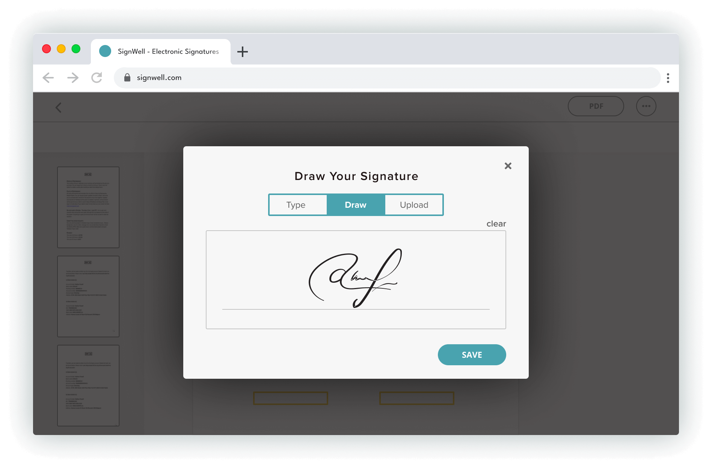

<div align="left">

[](https://signwell.com)

# Signwell<a id="signwell"></a>

When I started SignWell in 2019, I saw there was a need for an alternative to the hard-to-use and expensive e-signature software already out there. Documents can be complicated enough, but getting a document signed shouldn't be complicated too.

At SignWell, we pride ourselves not only on the ease and affordability of our e-signature process but also on our personalized and industry-leading customer support — whether it's for individual use or larger team accounts, SignWell is here to help you feel comfortable and confident getting your documents signed.

The SignWell mission? Simplify how documents get signed for millions of people and businesses. We're excited to help you continue to move toward the future of paperless document signing.

Ruben Gamez
Founder, SignWell


</div>

## Table of Contents<a id="table-of-contents"></a>

<!-- toc -->

- [Requirements](#requirements)
- [Installation](#installation)
- [Getting Started](#getting-started)
- [Async](#async)
- [Raw HTTP Response](#raw-http-response)
- [Reference](#reference)
  * [`signwell.api_application.delete_by_id`](#signwellapi_applicationdelete_by_id)
  * [`signwell.api_application.get_details`](#signwellapi_applicationget_details)
  * [`signwell.bulk_send.create_validation_csv`](#signwellbulk_sendcreate_validation_csv)
  * [`signwell.bulk_send.get_csv_template`](#signwellbulk_sendget_csv_template)
  * [`signwell.bulk_send.get_documents`](#signwellbulk_sendget_documents)
  * [`signwell.bulk_send.get_information`](#signwellbulk_sendget_information)
  * [`signwell.bulk_send.list_bulk_sendings`](#signwellbulk_sendlist_bulk_sendings)
  * [`signwell.bulk_send.validate_csv`](#signwellbulk_sendvalidate_csv)
  * [`signwell.document.create_from_template`](#signwelldocumentcreate_from_template)
  * [`signwell.document.create_new_document`](#signwelldocumentcreate_new_document)
  * [`signwell.document.delete_document`](#signwelldocumentdelete_document)
  * [`signwell.document.get_completed_pdf`](#signwelldocumentget_completed_pdf)
  * [`signwell.document.get_document_data`](#signwelldocumentget_document_data)
  * [`signwell.document.send_reminder`](#signwelldocumentsend_reminder)
  * [`signwell.document.update_and_send`](#signwelldocumentupdate_and_send)
  * [`signwell.me.get_account_info`](#signwellmeget_account_info)
  * [`signwell.template.create_new`](#signwelltemplatecreate_new)
  * [`signwell.template.delete_document_template`](#signwelltemplatedelete_document_template)
  * [`signwell.template.get_template_data`](#signwelltemplateget_template_data)
  * [`signwell.template.update_existing_template`](#signwelltemplateupdate_existing_template)
  * [`signwell.webhooks.delete_callback_url`](#signwellwebhooksdelete_callback_url)
  * [`signwell.webhooks.get_all`](#signwellwebhooksget_all)
  * [`signwell.webhooks.register_callback_url`](#signwellwebhooksregister_callback_url)

<!-- tocstop -->

## Requirements<a id="requirements"></a>

Python >=3.7

## Installation<a id="installation"></a>
<div align="center">
  <a href="https://konfigthis.com/sdk-sign-up?company=SignWell&language=Python">
    
  </a>
</div>

## Getting Started<a id="getting-started"></a>

```python
from pprint import pprint
from sign_well_python_sdk import SignWell, ApiException

signwell = SignWell(
    api_key="YOUR_API_KEY",
)

try:
    # Delete API Application
    signwell.api_application.delete_by_id(
        id="id_example",
    )
except ApiException as e:
    print("Exception when calling APIApplicationApi.delete_by_id: %s\n" % e)
    pprint(e.body)
    if e.status == 404:
        pprint(e.body["message"])
        pprint(e.body["meta"])
    pprint(e.headers)
    pprint(e.status)
    pprint(e.reason)
    pprint(e.round_trip_time)
```

## Async<a id="async"></a>

`async` support is available by prepending `a` to any method.

```python
import asyncio
from pprint import pprint
from sign_well_python_sdk import SignWell, ApiException

signwell = SignWell(
    api_key="YOUR_API_KEY",
)


async def main():
    try:
        # Delete API Application
        await signwell.api_application.adelete_by_id(
            id="id_example",
        )
    except ApiException as e:
        print("Exception when calling APIApplicationApi.delete_by_id: %s\n" % e)
        pprint(e.body)
        if e.status == 404:
            pprint(e.body["message"])
            pprint(e.body["meta"])
        pprint(e.headers)
        pprint(e.status)
        pprint(e.reason)
        pprint(e.round_trip_time)


asyncio.run(main())
```

## Raw HTTP Response<a id="raw-http-response"></a>

To access raw HTTP response values, use the `.raw` namespace.

```python
from pprint import pprint
from sign_well_python_sdk import SignWell, ApiException

signwell = SignWell(
    api_key="YOUR_API_KEY",
)

try:
    # Delete API Application
    delete_by_id_response = signwell.api_application.raw.delete_by_id(
        id="id_example",
    )
    pprint(delete_by_id_response.headers)
    pprint(delete_by_id_response.status)
    pprint(delete_by_id_response.round_trip_time)
except ApiException as e:
    print("Exception when calling APIApplicationApi.delete_by_id: %s\n" % e)
    pprint(e.body)
    if e.status == 404:
        pprint(e.body["message"])
        pprint(e.body["meta"])
    pprint(e.headers)
    pprint(e.status)
    pprint(e.reason)
    pprint(e.round_trip_time)
```


## Reference<a id="reference"></a>
### `signwell.api_application.delete_by_id`<a id="signwellapi_applicationdelete_by_id"></a>

Deletes an API Application from an account. Supply the unique Application ID from either the Create API Application response or the API Application edit page

#### 🛠️ Usage<a id="🛠️-usage"></a>

```python
signwell.api_application.delete_by_id(
    id="id_example",
)
```

#### ⚙️ Parameters<a id="⚙️-parameters"></a>

##### id: `str`<a id="id-str"></a>

#### 🌐 Endpoint<a id="🌐-endpoint"></a>

`/api/v1/api_applications/{id}` `delete`

[🔙 **Back to Table of Contents**](#table-of-contents)

---

### `signwell.api_application.get_details`<a id="signwellapi_applicationget_details"></a>

Gets the details of a specific API Application within an account. Supply the unique Application ID from either the Create API Application response or the API Application edit page.

#### 🛠️ Usage<a id="🛠️-usage"></a>

```python
get_details_response = signwell.api_application.get_details(
    id="id_example",
)
```

#### ⚙️ Parameters<a id="⚙️-parameters"></a>

##### id: `str`<a id="id-str"></a>

#### 🔄 Return<a id="🔄-return"></a>

[`ApiApplicationGetDetailsResponse`](./sign_well_python_sdk/pydantic/api_application_get_details_response.py)

#### 🌐 Endpoint<a id="🌐-endpoint"></a>

`/api/v1/api_applications/{id}` `get`

[🔙 **Back to Table of Contents**](#table-of-contents)

---

### `signwell.bulk_send.create_validation_csv`<a id="signwellbulk_sendcreate_validation_csv"></a>

Creates a bulk send, and it validates the CSV file before creating the bulk send.

#### 🛠️ Usage<a id="🛠️-usage"></a>

```python
create_validation_csv_response = signwell.bulk_send.create_validation_csv(
    template_ids=["046b6c7f-0b8a-43b9-b35d-6489e6daee91"],
    bulk_send_csv="YQ==",
    skip_row_errors=False,
    api_application_id="046b6c7f-0b8a-43b9-b35d-6489e6daee91",
    name="string_example",
    subject="string_example",
    message="string_example",
    apply_signing_order=False,
    custom_requester_name="string_example",
    custom_requester_email="string_example",
)
```

#### ⚙️ Parameters<a id="⚙️-parameters"></a>

##### template_ids: [`TemplateIdsParamMap`](./sign_well_python_sdk/type/template_ids_param_map.py)<a id="template_ids-templateidsparammapsign_well_python_sdktypetemplate_ids_param_mappy"></a>

##### bulk_send_csv: `str`<a id="bulk_send_csv-str"></a>

A RFC 4648 base64 string of the template CSV file to be validated.

##### skip_row_errors: `bool`<a id="skip_row_errors-bool"></a>

Whether to skip errors in the rows. Defaults to `false`.

##### api_application_id: `str`<a id="api_application_id-str"></a>

Unique identifier for API Application settings to use. API Applications are optional and mainly used when isolating OAuth apps or for more control over embedded API settings

##### name: `str`<a id="name-str"></a>

The name of the Bulk Send. Will be used as the document name for each of the documents.

##### subject: `str`<a id="subject-str"></a>

Email subject for the signature request that recipients will see. Defaults to the default system subject or a template subject.

##### message: `str`<a id="message-str"></a>

Email message for the signature request that recipients will see. Defaults to the default system message or a template message.

##### apply_signing_order: `bool`<a id="apply_signing_order-bool"></a>

When set to `true` recipients will sign one at a time in the order of the `recipients` collection of this request.

##### custom_requester_name: `str`<a id="custom_requester_name-str"></a>

Sets the custom requester name for the document. When set, this is the name used for all email communications, signing notifications, and in the audit file.

##### custom_requester_email: `str`<a id="custom_requester_email-str"></a>

Sets the custom requester email for the document. When set, this is the email used for all email communications, signing notifications, and in the audit file.

#### ⚙️ Request Body<a id="⚙️-request-body"></a>

[`CreateBulkSendRequest`](./sign_well_python_sdk/type/create_bulk_send_request.py)
#### 🔄 Return<a id="🔄-return"></a>

[`BulkSendCreateValidationCsvResponse`](./sign_well_python_sdk/pydantic/bulk_send_create_validation_csv_response.py)

#### 🌐 Endpoint<a id="🌐-endpoint"></a>

`/api/v1/bulk_sends` `post`

[🔙 **Back to Table of Contents**](#table-of-contents)

---

### `signwell.bulk_send.get_csv_template`<a id="signwellbulk_sendget_csv_template"></a>

Fetches a CSV template that corresponds to the provided document template IDs. CSV templates are blank CSV files that have columns containing required and optional data that can be sent when creating a bulk send. Fields can be referenced by the field label. Example: [placeholder name]_[field label] could be something like customer_address or signer_company_name (if "Customer" and "Signer" were placeholder names for templates set up in SignWell).

#### 🛠️ Usage<a id="🛠️-usage"></a>

```python
get_csv_template_response = signwell.bulk_send.get_csv_template(
    template_ids_=["template_ids[]_example"],
    base64="YQ==",
)
```

#### ⚙️ Parameters<a id="⚙️-parameters"></a>

##### template_ids_: [`BulkSendTemplateIdsParamMap`](./sign_well_python_sdk/type/.py)<a id="template_ids_-bulksendtemplateidsparammapsign_well_python_sdktypepy"></a>

##### base64: `str`<a id="base64-str"></a>

#### 🔄 Return<a id="🔄-return"></a>

[`BulkSendGetCsvTemplate200Response`](./sign_well_python_sdk/pydantic/bulk_send_get_csv_template200_response.py)

#### 🌐 Endpoint<a id="🌐-endpoint"></a>

`/api/v1/bulk_sends/csv_template` `get`

[🔙 **Back to Table of Contents**](#table-of-contents)

---

### `signwell.bulk_send.get_documents`<a id="signwellbulk_sendget_documents"></a>

Returns information about the Bulk Send.

#### 🛠️ Usage<a id="🛠️-usage"></a>

```python
get_documents_response = signwell.bulk_send.get_documents(
    id="id_example",
    limit=10,
    page=1,
)
```

#### ⚙️ Parameters<a id="⚙️-parameters"></a>

##### id: `str`<a id="id-str"></a>

##### limit: [`LimitMap`](./sign_well_python_sdk/type/.py)<a id="limit-limitmapsign_well_python_sdktypepy"></a>

##### page: [`PageOffsetMap`](./sign_well_python_sdk/type/.py)<a id="page-pageoffsetmapsign_well_python_sdktypepy"></a>

#### 🔄 Return<a id="🔄-return"></a>

[`BulkSendGetDocumentsResponse`](./sign_well_python_sdk/pydantic/bulk_send_get_documents_response.py)

#### 🌐 Endpoint<a id="🌐-endpoint"></a>

`/api/v1/bulk_sends/{id}/documents` `get`

[🔙 **Back to Table of Contents**](#table-of-contents)

---

### `signwell.bulk_send.get_information`<a id="signwellbulk_sendget_information"></a>

Returns information about the Bulk Send.

#### 🛠️ Usage<a id="🛠️-usage"></a>

```python
get_information_response = signwell.bulk_send.get_information(
    id="id_example",
)
```

#### ⚙️ Parameters<a id="⚙️-parameters"></a>

##### id: `str`<a id="id-str"></a>

#### 🔄 Return<a id="🔄-return"></a>

[`BulkSendGetInformationResponse`](./sign_well_python_sdk/pydantic/bulk_send_get_information_response.py)

#### 🌐 Endpoint<a id="🌐-endpoint"></a>

`/api/v1/bulk_sends/{id}` `get`

[🔙 **Back to Table of Contents**](#table-of-contents)

---

### `signwell.bulk_send.list_bulk_sendings`<a id="signwellbulk_sendlist_bulk_sendings"></a>

Returns information about the Bulk Send.

#### 🛠️ Usage<a id="🛠️-usage"></a>

```python
list_bulk_sendings_response = signwell.bulk_send.list_bulk_sendings(
    user_email="string_example",
    limit=10,
    page=1,
    api_application_id="046b6c7f-0b8a-43b9-b35d-6489e6daee91",
)
```

#### ⚙️ Parameters<a id="⚙️-parameters"></a>

##### user_email: `str`<a id="user_email-str"></a>

##### limit: [`LimitMap`](./sign_well_python_sdk/type/.py)<a id="limit-limitmapsign_well_python_sdktypepy"></a>

##### page: [`PageOffsetMap`](./sign_well_python_sdk/type/.py)<a id="page-pageoffsetmapsign_well_python_sdktypepy"></a>

##### api_application_id: `str`<a id="api_application_id-str"></a>

#### 🔄 Return<a id="🔄-return"></a>

[`BulkSendListBulkSendingsResponse`](./sign_well_python_sdk/pydantic/bulk_send_list_bulk_sendings_response.py)

#### 🌐 Endpoint<a id="🌐-endpoint"></a>

`/api/v1/bulk_sends` `get`

[🔙 **Back to Table of Contents**](#table-of-contents)

---

### `signwell.bulk_send.validate_csv`<a id="signwellbulk_sendvalidate_csv"></a>

Validates a Bulk Send CSV file before creating the Bulk Send. It will check the structure of the CSV and the data it contains, and return any errors found.

#### 🛠️ Usage<a id="🛠️-usage"></a>

```python
validate_csv_response = signwell.bulk_send.validate_csv(
    template_ids=["046b6c7f-0b8a-43b9-b35d-6489e6daee91"],
    bulk_send_csv="YQ==",
)
```

#### ⚙️ Parameters<a id="⚙️-parameters"></a>

##### template_ids: [`BulkSendTemplateIdsParamMap`](./sign_well_python_sdk/type/bulk_send_template_ids_param_map.py)<a id="template_ids-bulksendtemplateidsparammapsign_well_python_sdktypebulk_send_template_ids_param_mappy"></a>

##### bulk_send_csv: `str`<a id="bulk_send_csv-str"></a>

A RFC 4648 base64 string of the template CSV file to be validated.

#### ⚙️ Request Body<a id="⚙️-request-body"></a>

[`BulkSendCsvRequest`](./sign_well_python_sdk/type/bulk_send_csv_request.py)
#### 🔄 Return<a id="🔄-return"></a>

[`BulkSendValidateCsvResponse`](./sign_well_python_sdk/pydantic/bulk_send_validate_csv_response.py)

#### 🌐 Endpoint<a id="🌐-endpoint"></a>

`/api/v1/bulk_sends/validate_csv` `post`

[🔙 **Back to Table of Contents**](#table-of-contents)

---

### `signwell.document.create_from_template`<a id="signwelldocumentcreate_from_template"></a>

Creates and optionally sends a new document for signing. If `draft` is set to false the document will not be sent.

#### 🛠️ Usage<a id="🛠️-usage"></a>

```python
create_from_template_response = signwell.document.create_from_template(
    recipients=[
        {
            "id": "id_example",
            "email": "email_example",
            "send_email": False,
            "send_email_delay": 0,
        }
    ],
    test_mode=False,
    template_id="046b6c7f-0b8a-43b9-b35d-6489e6daee91",
    template_ids=["string_example"],
    name="string_example",
    subject="string_example",
    message="string_example",
    draft=False,
    with_signature_page=False,
    expires_in=1,
    reminders=True,
    apply_signing_order=False,
    api_application_id="046b6c7f-0b8a-43b9-b35d-6489e6daee91",
    embedded_signing=False,
    embedded_signing_notifications=False,
    text_tags=False,
    custom_requester_name="string_example",
    custom_requester_email="string_example",
    redirect_url="string_example",
    allow_decline=True,
    allow_reassign=True,
    decline_redirect_url="string_example",
    metadata={},
    template_fields=[
        {
            "api_id": "api_id_example",
            "value": None,
        }
    ],
    files=[
        {
            "name": "name_example",
        }
    ],
    fields=[
        [
            {
                "x": 3.14,
                "y": 3.14,
                "page": 1,
                "recipient_id": "recipient_id_example",
                "type": "initials",
                "required": True,
                "validation": "no_text_validation",
                "fixed_width": False,
                "lock_sign_date": False,
                "date_format": "MM/DD/YYYY",
            }
        ]
    ],
    attachment_requests=[
        {
            "name": "name_example",
            "recipient_id": "recipient_id_example",
            "required": True,
        }
    ],
    copied_contacts=[
        {
            "email": "email_example",
        }
    ],
)
```

#### ⚙️ Parameters<a id="⚙️-parameters"></a>

##### recipients: [`TemplateRecipientsMap`](./sign_well_python_sdk/type/template_recipients_map.py)<a id="recipients-templaterecipientsmapsign_well_python_sdktypetemplate_recipients_mappy"></a>

##### test_mode: `bool`<a id="test_mode-bool"></a>

Set to `true` to enable Test Mode. Documents created with Test Mode do not count towards API billing and are not legally binding. Defaults to `false`

##### template_id: `str`<a id="template_id-str"></a>

Use when you have to create a document from a single template. Either :template_id or :template_ids must be present in the request, not both.

##### template_ids: [`TemplateIdsMap`](./sign_well_python_sdk/type/template_ids_map.py)<a id="template_ids-templateidsmapsign_well_python_sdktypetemplate_ids_mappy"></a>

##### name: `str`<a id="name-str"></a>

The name of the document.

##### subject: `str`<a id="subject-str"></a>

Email subject for the signature request that recipients will see. Defaults to the default system subject or a template subject (if the document is created from a template).

##### message: `str`<a id="message-str"></a>

Email message for the signature request that recipients will see. Defaults to the default system message or a template message (if the document is created from a template).

##### draft: `bool`<a id="draft-bool"></a>

Whether the document can still be updated before sending a signature request. If set to `false` the document is sent for signing as part of this request. Defaults to `false`.

##### with_signature_page: `bool`<a id="with_signature_page-bool"></a>

When set to `true` the document will have a signature page added to the end, and all signers will be required to add their signature on that page.

##### expires_in: [`ExpiresInMap`](./sign_well_python_sdk/type/expires_in_map.py)<a id="expires_in-expiresinmapsign_well_python_sdktypeexpires_in_mappy"></a>

##### reminders: `bool`<a id="reminders-bool"></a>

Whether to send signing reminders to recipients. Reminders are sent on day 3, day 6, and day 10 if set to `true`. Defaults to `true`.

##### apply_signing_order: `bool`<a id="apply_signing_order-bool"></a>

When set to `true` recipients will sign one at a time in the order of the `recipients` collection of this request.

##### api_application_id: `str`<a id="api_application_id-str"></a>

Unique identifier for API Application settings to use. API Applications are optional and mainly used when isolating OAuth apps or for more control over embedded API settings

##### embedded_signing: `bool`<a id="embedded_signing-bool"></a>

When set to `true` it enables embedded signing in your website/web application. Embedded functionality works with an iFrame and email authentication is disabled. :embedded_signinig defaults to `false`.

##### embedded_signing_notifications: `bool`<a id="embedded_signing_notifications-bool"></a>

On embedding signing, document owners (and CC'd contacts) do not get a notification email when documents have been completed. Setting this param to `true` will send out those final completed notifications. Default is `false`

##### text_tags: `bool`<a id="text_tags-bool"></a>

An alternative way (if you can’t use the recommended way) of placing fields in specific locations of your document by using special text tags. Useful when changing the content of your files changes the location of fields. See API documentation for “Text Tags” for details. Defaults to false.

##### custom_requester_name: `str`<a id="custom_requester_name-str"></a>

Sets the custom requester name for the document. When set, this is the name used for all email communications, signing notifications, and in the audit file.

##### custom_requester_email: `str`<a id="custom_requester_email-str"></a>

Sets the custom requester email for the document. When set, this is the email used for all email communications, signing notifications, and in the audit file.

##### redirect_url: `str`<a id="redirect_url-str"></a>

A URL that recipients are redirected to after successfully signing a document.

##### allow_decline: `bool`<a id="allow_decline-bool"></a>

Whether to allow recipients the option to decline signing a document. If multiple signers are involved in a document, any single recipient can cancel the entire document signing process by declining to sign.

##### allow_reassign: `bool`<a id="allow_reassign-bool"></a>

In some cases a signer is not the right person to sign and may need to reassign their signing responsibilities to another person. This feature allows them to reassign the document to someone else.

##### decline_redirect_url: `str`<a id="decline_redirect_url-str"></a>

A URL that recipients are redirected to if the document is declined.

##### metadata: `Dict[str, Union[bool, date, datetime, dict, float, int, list, str, None]]`<a id="metadata-dictstr-unionbool-date-datetime-dict-float-int-list-str-none"></a>

Optional key-value data that can be associated with the document. If set, will be available every time the document data is returned.

##### template_fields: [`TemplateFieldsMap`](./sign_well_python_sdk/type/template_fields_map.py)<a id="template_fields-templatefieldsmapsign_well_python_sdktypetemplate_fields_mappy"></a>

##### files: [`AdditionalFilesMap`](./sign_well_python_sdk/type/additional_files_map.py)<a id="files-additionalfilesmapsign_well_python_sdktypeadditional_files_mappy"></a>

##### fields: [`AdditionalFieldsMap`](./sign_well_python_sdk/type/additional_fields_map.py)<a id="fields-additionalfieldsmapsign_well_python_sdktypeadditional_fields_mappy"></a>

##### attachment_requests: [`AttachmentRequestsMap`](./sign_well_python_sdk/type/attachment_requests_map.py)<a id="attachment_requests-attachmentrequestsmapsign_well_python_sdktypeattachment_requests_mappy"></a>

##### copied_contacts: [`CopiedContactsMap`](./sign_well_python_sdk/type/copied_contacts_map.py)<a id="copied_contacts-copiedcontactsmapsign_well_python_sdktypecopied_contacts_mappy"></a>

#### ⚙️ Request Body<a id="⚙️-request-body"></a>

[`DocumentFromTemplateRequest`](./sign_well_python_sdk/type/document_from_template_request.py)
#### 🔄 Return<a id="🔄-return"></a>

[`DocumentCreateFromTemplateResponse`](./sign_well_python_sdk/pydantic/document_create_from_template_response.py)

#### 🌐 Endpoint<a id="🌐-endpoint"></a>

`/api/v1/document_templates/documents` `post`

[🔙 **Back to Table of Contents**](#table-of-contents)

---

### `signwell.document.create_new_document`<a id="signwelldocumentcreate_new_document"></a>

Creates and optionally sends a new document for signing. If `draft` is set to false the document will not be sent.

#### 🛠️ Usage<a id="🛠️-usage"></a>

```python
create_new_document_response = signwell.document.create_new_document(
    files=[
        {
            "name": "name_example",
        }
    ],
    recipients=[
        {
            "id": "id_example",
            "email": "email_example",
            "send_email": False,
            "send_email_delay": 0,
        }
    ],
    test_mode=False,
    name="string_example",
    subject="string_example",
    message="string_example",
    draft=False,
    with_signature_page=False,
    expires_in=1,
    reminders=True,
    apply_signing_order=False,
    api_application_id="046b6c7f-0b8a-43b9-b35d-6489e6daee91",
    embedded_signing=False,
    embedded_signing_notifications=False,
    text_tags=False,
    custom_requester_name="string_example",
    custom_requester_email="string_example",
    redirect_url="string_example",
    allow_decline=True,
    allow_reassign=True,
    decline_redirect_url="string_example",
    metadata={},
    fields=[
        [
            {
                "x": 3.14,
                "y": 3.14,
                "page": 1,
                "recipient_id": "recipient_id_example",
                "type": "initials",
                "required": True,
                "validation": "no_text_validation",
                "fixed_width": False,
                "lock_sign_date": False,
                "date_format": "MM/DD/YYYY",
            }
        ]
    ],
    attachment_requests=[
        {
            "name": "name_example",
            "recipient_id": "recipient_id_example",
            "required": True,
        }
    ],
    copied_contacts=[
        {
            "email": "email_example",
        }
    ],
)
```

#### ⚙️ Parameters<a id="⚙️-parameters"></a>

##### files: [`FilesMap`](./sign_well_python_sdk/type/files_map.py)<a id="files-filesmapsign_well_python_sdktypefiles_mappy"></a>

##### recipients: [`DocumentRecipientsMap`](./sign_well_python_sdk/type/document_recipients_map.py)<a id="recipients-documentrecipientsmapsign_well_python_sdktypedocument_recipients_mappy"></a>

##### test_mode: `bool`<a id="test_mode-bool"></a>

Set to `true` to enable Test Mode. Documents created with Test Mode do not count towards API billing and are not legally binding. Defaults to `false`

##### name: `str`<a id="name-str"></a>

The name of the document.

##### subject: `str`<a id="subject-str"></a>

Email subject for the signature request that recipients will see. Defaults to the default system subject or a template subject (if the document is created from a template).

##### message: `str`<a id="message-str"></a>

Email message for the signature request that recipients will see. Defaults to the default system message or a template message (if the document is created from a template).

##### draft: `bool`<a id="draft-bool"></a>

Whether the document can still be updated before sending a signature request. If set to `false` the document is sent for signing as part of this request. Defaults to `false`.

##### with_signature_page: `bool`<a id="with_signature_page-bool"></a>

When set to `true` the document will have a signature page added to the end, and all signers will be required to add their signature on that page.

##### expires_in: [`ExpiresInMap`](./sign_well_python_sdk/type/expires_in_map.py)<a id="expires_in-expiresinmapsign_well_python_sdktypeexpires_in_mappy"></a>

##### reminders: `bool`<a id="reminders-bool"></a>

Whether to send signing reminders to recipients. Reminders are sent on day 3, day 6, and day 10 if set to `true`. Defaults to `true`.

##### apply_signing_order: `bool`<a id="apply_signing_order-bool"></a>

When set to `true` recipients will sign one at a time in the order of the `recipients` collection of this request.

##### api_application_id: `str`<a id="api_application_id-str"></a>

Unique identifier for API Application settings to use. API Applications are optional and mainly used when isolating OAuth apps or for more control over embedded API settings

##### embedded_signing: `bool`<a id="embedded_signing-bool"></a>

When set to `true` it enables embedded signing in your website/web application. Embedded functionality works with an iFrame and email authentication is disabled. :embedded_signinig defaults to `false`.

##### embedded_signing_notifications: `bool`<a id="embedded_signing_notifications-bool"></a>

On embedding signing, document owners (and CC'd contacts) do not get a notification email when documents have been completed. Setting this param to `true` will send out those final completed notifications. Default is `false`

##### text_tags: `bool`<a id="text_tags-bool"></a>

An alternative way (if you can’t use the recommended way) of placing fields in specific locations of your document by using special text tags. Useful when changing the content of your files changes the location of fields. See API documentation for “Text Tags” for details. Defaults to false.

##### custom_requester_name: `str`<a id="custom_requester_name-str"></a>

Sets the custom requester name for the document. When set, this is the name used for all email communications, signing notifications, and in the audit file.

##### custom_requester_email: `str`<a id="custom_requester_email-str"></a>

Sets the custom requester email for the document. When set, this is the email used for all email communications, signing notifications, and in the audit file.

##### redirect_url: `str`<a id="redirect_url-str"></a>

A URL that recipients are redirected to after successfully signing a document.

##### allow_decline: `bool`<a id="allow_decline-bool"></a>

Whether to allow recipients the option to decline signing a document. If multiple signers are involved in a document, any single recipient can cancel the entire document signing process by declining to sign.

##### allow_reassign: `bool`<a id="allow_reassign-bool"></a>

In some cases a signer is not the right person to sign and may need to reassign their signing responsibilities to another person. This feature allows them to reassign the document to someone else.

##### decline_redirect_url: `str`<a id="decline_redirect_url-str"></a>

A URL that recipients are redirected to if the document is declined.

##### metadata: `Dict[str, Union[bool, date, datetime, dict, float, int, list, str, None]]`<a id="metadata-dictstr-unionbool-date-datetime-dict-float-int-list-str-none"></a>

Optional key-value data that can be associated with the document. If set, will be available every time the document data is returned.

##### fields: [`FieldsMap`](./sign_well_python_sdk/type/fields_map.py)<a id="fields-fieldsmapsign_well_python_sdktypefields_mappy"></a>

##### attachment_requests: [`AttachmentRequestsMap`](./sign_well_python_sdk/type/attachment_requests_map.py)<a id="attachment_requests-attachmentrequestsmapsign_well_python_sdktypeattachment_requests_mappy"></a>

##### copied_contacts: [`CopiedContactsMap`](./sign_well_python_sdk/type/copied_contacts_map.py)<a id="copied_contacts-copiedcontactsmapsign_well_python_sdktypecopied_contacts_mappy"></a>

#### ⚙️ Request Body<a id="⚙️-request-body"></a>

[`DocumentRequest`](./sign_well_python_sdk/type/document_request.py)
#### 🔄 Return<a id="🔄-return"></a>

[`DocumentCreateNewDocumentResponse`](./sign_well_python_sdk/pydantic/document_create_new_document_response.py)

#### 🌐 Endpoint<a id="🌐-endpoint"></a>

`/api/v1/documents` `post`

[🔙 **Back to Table of Contents**](#table-of-contents)

---

### `signwell.document.delete_document`<a id="signwelldocumentdelete_document"></a>

Deletes a document. Deleting a document will also cancel document signing (if in progress).  Supply the unique document ID from either a Create Document request or document page URL.

#### 🛠️ Usage<a id="🛠️-usage"></a>

```python
signwell.document.delete_document(
    id="id_example",
)
```

#### ⚙️ Parameters<a id="⚙️-parameters"></a>

##### id: `str`<a id="id-str"></a>

#### 🌐 Endpoint<a id="🌐-endpoint"></a>

`/api/v1/documents/{id}` `delete`

[🔙 **Back to Table of Contents**](#table-of-contents)

---

### `signwell.document.get_completed_pdf`<a id="signwelldocumentget_completed_pdf"></a>

Gets a completed document PDF. Supply the unique document ID from either a document creation request or document page URL.

#### 🛠️ Usage<a id="🛠️-usage"></a>

```python
get_completed_pdf_response = signwell.document.get_completed_pdf(
    id="id_example",
    url_only=False,
    audit_page=True,
)
```

#### ⚙️ Parameters<a id="⚙️-parameters"></a>

##### id: `str`<a id="id-str"></a>

##### url_only: `bool`<a id="url_only-bool"></a>

##### audit_page: `bool`<a id="audit_page-bool"></a>

#### 🔄 Return<a id="🔄-return"></a>

[`DocumentGetCompletedPdfResponse`](./sign_well_python_sdk/pydantic/document_get_completed_pdf_response.py)

#### 🌐 Endpoint<a id="🌐-endpoint"></a>

`/api/v1/documents/{id}/completed_pdf` `get`

[🔙 **Back to Table of Contents**](#table-of-contents)

---

### `signwell.document.get_document_data`<a id="signwelldocumentget_document_data"></a>

Returns a document and all associated document data. Supply the unique document ID from either a document creation request or Document page URL.

#### 🛠️ Usage<a id="🛠️-usage"></a>

```python
get_document_data_response = signwell.document.get_document_data(
    id="id_example",
)
```

#### ⚙️ Parameters<a id="⚙️-parameters"></a>

##### id: `str`<a id="id-str"></a>

#### 🔄 Return<a id="🔄-return"></a>

[`DocumentGetDocumentDataResponse`](./sign_well_python_sdk/pydantic/document_get_document_data_response.py)

#### 🌐 Endpoint<a id="🌐-endpoint"></a>

`/api/v1/documents/{id}` `get`

[🔙 **Back to Table of Contents**](#table-of-contents)

---

### `signwell.document.send_reminder`<a id="signwelldocumentsend_reminder"></a>

Sends a reminder email to recipients that have not signed yet.

#### 🛠️ Usage<a id="🛠️-usage"></a>

```python
send_reminder_response = signwell.document.send_reminder(
    id="id_example",
    recipients=[{}],
)
```

#### ⚙️ Parameters<a id="⚙️-parameters"></a>

##### id: `str`<a id="id-str"></a>

##### recipients: [`RemindRecipientsMap`](./sign_well_python_sdk/type/remind_recipients_map.py)<a id="recipients-remindrecipientsmapsign_well_python_sdktyperemind_recipients_mappy"></a>

#### ⚙️ Request Body<a id="⚙️-request-body"></a>

[`SendReminderRequest`](./sign_well_python_sdk/type/send_reminder_request.py)
#### 🔄 Return<a id="🔄-return"></a>

[`DocumentSendReminderResponse`](./sign_well_python_sdk/pydantic/document_send_reminder_response.py)

#### 🌐 Endpoint<a id="🌐-endpoint"></a>

`/api/v1/documents/{id}/remind` `post`

[🔙 **Back to Table of Contents**](#table-of-contents)

---

### `signwell.document.update_and_send`<a id="signwelldocumentupdate_and_send"></a>

Updates a draft document and sends it to be signed by recipients.

#### 🛠️ Usage<a id="🛠️-usage"></a>

```python
update_and_send_response = signwell.document.update_and_send(
    id="id_example",
    test_mode=False,
    name="string_example",
    subject="string_example",
    message="string_example",
    expires_in=1,
    reminders=True,
    apply_signing_order=False,
    api_application_id="046b6c7f-0b8a-43b9-b35d-6489e6daee91",
    embedded_signing=False,
    embedded_signing_notifications=False,
    custom_requester_name="string_example",
    custom_requester_email="string_example",
    redirect_url="string_example",
    allow_decline=True,
    allow_reassign=True,
    decline_redirect_url="string_example",
    metadata={},
)
```

#### ⚙️ Parameters<a id="⚙️-parameters"></a>

##### id: `str`<a id="id-str"></a>

##### test_mode: `bool`<a id="test_mode-bool"></a>

Set to `true` to enable Test Mode. Documents created with Test Mode do not count towards API billing and are not legally binding. Defaults to `false`

##### name: `str`<a id="name-str"></a>

The name of the document.

##### subject: `str`<a id="subject-str"></a>

Email subject for the signature request that recipients will see. Defaults to the default system subject or a template subject (if the document is created from a template).

##### message: `str`<a id="message-str"></a>

Email message for the signature request that recipients will see. Defaults to the default system message or a template message (if the document is created from a template).

##### expires_in: [`ExpiresInMap`](./sign_well_python_sdk/type/expires_in_map.py)<a id="expires_in-expiresinmapsign_well_python_sdktypeexpires_in_mappy"></a>

##### reminders: `bool`<a id="reminders-bool"></a>

Whether to send signing reminders to recipients. Reminders are sent on day 3, day 6, and day 10 if set to `true`. Defaults to `true`.

##### apply_signing_order: `bool`<a id="apply_signing_order-bool"></a>

When set to `true` recipients will sign one at a time in the order of the `recipients` collection of this request.

##### api_application_id: `str`<a id="api_application_id-str"></a>

Unique identifier for API Application settings to use. API Applications are optional and mainly used when isolating OAuth apps or for more control over embedded API settings

##### embedded_signing: `bool`<a id="embedded_signing-bool"></a>

When set to `true` it enables embedded signing in your website/web application. Embedded functionality works with an iFrame and email authentication is disabled. :embedded_signinig defaults to `false`.

##### embedded_signing_notifications: `bool`<a id="embedded_signing_notifications-bool"></a>

On embedding signing, document owners (and CC'd contacts) do not get a notification email when documents have been completed. Setting this param to `true` will send out those final completed notifications. Default is `false`

##### custom_requester_name: `str`<a id="custom_requester_name-str"></a>

Sets the custom requester name for the document. When set, this is the name used for all email communications, signing notifications, and in the audit file.

##### custom_requester_email: `str`<a id="custom_requester_email-str"></a>

Sets the custom requester email for the document. When set, this is the email used for all email communications, signing notifications, and in the audit file.

##### redirect_url: `str`<a id="redirect_url-str"></a>

A URL that recipients are redirected to after successfully signing a document.

##### allow_decline: `bool`<a id="allow_decline-bool"></a>

Whether to allow recipients the option to decline signing a document. If multiple signers are involved in a document, any single recipient can cancel the entire document signing process by declining to sign.

##### allow_reassign: `bool`<a id="allow_reassign-bool"></a>

In some cases a signer is not the right person to sign and may need to reassign their signing responsibilities to another person. This feature allows them to reassign the document to someone else.

##### decline_redirect_url: `str`<a id="decline_redirect_url-str"></a>

A URL that recipients are redirected to if the document is declined.

##### metadata: `Dict[str, Union[bool, date, datetime, dict, float, int, list, str, None]]`<a id="metadata-dictstr-unionbool-date-datetime-dict-float-int-list-str-none"></a>

Optional key-value data that can be associated with the document. If set, will be available every time the document data is returned.

#### ⚙️ Request Body<a id="⚙️-request-body"></a>

[`UpdateDocumentAndSendRequest`](./sign_well_python_sdk/type/update_document_and_send_request.py)
#### 🔄 Return<a id="🔄-return"></a>

[`DocumentUpdateAndSendResponse`](./sign_well_python_sdk/pydantic/document_update_and_send_response.py)

#### 🌐 Endpoint<a id="🌐-endpoint"></a>

`/api/v1/documents/{id}/send` `post`

[🔙 **Back to Table of Contents**](#table-of-contents)

---

### `signwell.me.get_account_info`<a id="signwellmeget_account_info"></a>

Retrieves the account information associated with the API key being used.

#### 🛠️ Usage<a id="🛠️-usage"></a>

```python
get_account_info_response = signwell.me.get_account_info()
```

#### 🔄 Return<a id="🔄-return"></a>

[`MeGetAccountInfoResponse`](./sign_well_python_sdk/pydantic/me_get_account_info_response.py)

#### 🌐 Endpoint<a id="🌐-endpoint"></a>

`/api/v1/me` `get`

[🔙 **Back to Table of Contents**](#table-of-contents)

---

### `signwell.template.create_new`<a id="signwelltemplatecreate_new"></a>

Creates a new template.

#### 🛠️ Usage<a id="🛠️-usage"></a>

```python
create_new_response = signwell.template.create_new(
    files=[
        {
            "name": "name_example",
        }
    ],
    placeholders=[
        {
            "id": "id_example",
            "name": "name_example",
        }
    ],
    name="string_example",
    subject="string_example",
    message="string_example",
    copied_placeholders=[
        {
            "name": "name_example",
        }
    ],
    draft=False,
    expires_in=1,
    reminders=True,
    apply_signing_order=False,
    api_application_id="046b6c7f-0b8a-43b9-b35d-6489e6daee91",
    text_tags=False,
    redirect_url="string_example",
    allow_decline=True,
    allow_reassign=True,
    decline_redirect_url="string_example",
    metadata={},
    fields=[
        [
            {
                "x": 3.14,
                "y": 3.14,
                "page": 1,
                "placeholder_id": "placeholder_id_example",
                "type": "initials",
                "required": True,
                "validation": "no_text_validation",
                "fixed_width": False,
                "lock_sign_date": False,
                "date_format": "MM/DD/YYYY",
            }
        ]
    ],
    attachment_requests=[
        {
            "name": "name_example",
            "placeholder_id": "placeholder_id_example",
            "required": True,
        }
    ],
)
```

#### ⚙️ Parameters<a id="⚙️-parameters"></a>

##### files: [`FilesMap`](./sign_well_python_sdk/type/files_map.py)<a id="files-filesmapsign_well_python_sdktypefiles_mappy"></a>

##### placeholders: [`PlaceholdersMap`](./sign_well_python_sdk/type/placeholders_map.py)<a id="placeholders-placeholdersmapsign_well_python_sdktypeplaceholders_mappy"></a>

##### name: `str`<a id="name-str"></a>

The name of the template.

##### subject: `str`<a id="subject-str"></a>

Email subject for the signature request that recipients will see. Defaults to the default system subject or a template subject (if the document is created from a template).

##### message: `str`<a id="message-str"></a>

Email message for the signature request that recipients will see. Defaults to the default system message or a template message (if the document is created from a template).

##### copied_placeholders: [`CopiedPlaceholdersMap`](./sign_well_python_sdk/type/copied_placeholders_map.py)<a id="copied_placeholders-copiedplaceholdersmapsign_well_python_sdktypecopied_placeholders_mappy"></a>

##### draft: `bool`<a id="draft-bool"></a>

Whether the template can still be updated before it is ready for usage. If set to `false` the template is marked as `Available` and it will be ready for use. Defaults to `false`.

##### expires_in: [`ExpiresInMap`](./sign_well_python_sdk/type/expires_in_map.py)<a id="expires_in-expiresinmapsign_well_python_sdktypeexpires_in_mappy"></a>

##### reminders: `bool`<a id="reminders-bool"></a>

Whether to send signing reminders to recipients. Reminders are sent on day 3, day 6, and day 10 if set to `true`. Defaults to `true`.

##### apply_signing_order: `bool`<a id="apply_signing_order-bool"></a>

When set to `true` recipients will sign one at a time in the order of the `recipients` collection of this request.

##### api_application_id: `str`<a id="api_application_id-str"></a>

Unique identifier for API Application settings to use. API Applications are optional and mainly used when isolating OAuth apps or for more control over embedded API settings

##### text_tags: `bool`<a id="text_tags-bool"></a>

An alternative way (if you can’t use the recommended way) of placing fields in specific locations of your document by using special text tags. Useful when changing the content of your files changes the location of fields. See API documentation for “Text Tags” for details. Defaults to false.

##### redirect_url: `str`<a id="redirect_url-str"></a>

A URL that recipients are redirected to after successfully signing a document.

##### allow_decline: `bool`<a id="allow_decline-bool"></a>

Whether to allow recipients the option to decline signing a document. If multiple signers are involved in a document, any single recipient can cancel the entire document signing process by declining to sign.

##### allow_reassign: `bool`<a id="allow_reassign-bool"></a>

In some cases a signer is not the right person to sign and may need to reassign their signing responsibilities to another person. This feature allows them to reassign the document to someone else.

##### decline_redirect_url: `str`<a id="decline_redirect_url-str"></a>

A URL that recipients are redirected to if the document is declined.

##### metadata: `Dict[str, Union[bool, date, datetime, dict, float, int, list, str, None]]`<a id="metadata-dictstr-unionbool-date-datetime-dict-float-int-list-str-none"></a>

Optional key-value data that can be associated with the document. If set, will be available every time the document data is returned.

##### fields: [`FieldsForTemplateMap`](./sign_well_python_sdk/type/fields_for_template_map.py)<a id="fields-fieldsfortemplatemapsign_well_python_sdktypefields_for_template_mappy"></a>

##### attachment_requests: [`AttachmentRequestsForTemplateMap`](./sign_well_python_sdk/type/attachment_requests_for_template_map.py)<a id="attachment_requests-attachmentrequestsfortemplatemapsign_well_python_sdktypeattachment_requests_for_template_mappy"></a>

#### ⚙️ Request Body<a id="⚙️-request-body"></a>

[`DocumentTemplateRequest`](./sign_well_python_sdk/type/document_template_request.py)
#### 🔄 Return<a id="🔄-return"></a>

[`TemplateCreateNewResponse`](./sign_well_python_sdk/pydantic/template_create_new_response.py)

#### 🌐 Endpoint<a id="🌐-endpoint"></a>

`/api/v1/document_templates` `post`

[🔙 **Back to Table of Contents**](#table-of-contents)

---

### `signwell.template.delete_document_template`<a id="signwelltemplatedelete_document_template"></a>

Deletes a template. Supply the unique template ID from either a Create Template request or template page URL.

#### 🛠️ Usage<a id="🛠️-usage"></a>

```python
signwell.template.delete_document_template(
    id="id_example",
)
```

#### ⚙️ Parameters<a id="⚙️-parameters"></a>

##### id: `str`<a id="id-str"></a>

#### 🌐 Endpoint<a id="🌐-endpoint"></a>

`/api/v1/document_templates/{id}` `delete`

[🔙 **Back to Table of Contents**](#table-of-contents)

---

### `signwell.template.get_template_data`<a id="signwelltemplateget_template_data"></a>

Returns a template and all associated template data. Supply the unique template ID from either a Create Template request or template page URL.

#### 🛠️ Usage<a id="🛠️-usage"></a>

```python
get_template_data_response = signwell.template.get_template_data(
    id="id_example",
)
```

#### ⚙️ Parameters<a id="⚙️-parameters"></a>

##### id: `str`<a id="id-str"></a>

#### 🔄 Return<a id="🔄-return"></a>

[`TemplateGetTemplateDataResponse`](./sign_well_python_sdk/pydantic/template_get_template_data_response.py)

#### 🌐 Endpoint<a id="🌐-endpoint"></a>

`/api/v1/document_templates/{id}` `get`

[🔙 **Back to Table of Contents**](#table-of-contents)

---

### `signwell.template.update_existing_template`<a id="signwelltemplateupdate_existing_template"></a>

Updates an existing template.

#### 🛠️ Usage<a id="🛠️-usage"></a>

```python
update_existing_template_response = signwell.template.update_existing_template(
    id="id_example",
    name="string_example",
    subject="string_example",
    message="string_example",
    draft=False,
    expires_in=1,
    reminders=True,
    apply_signing_order=False,
    api_application_id="046b6c7f-0b8a-43b9-b35d-6489e6daee91",
    redirect_url="string_example",
    allow_decline=True,
    allow_reassign=True,
    decline_redirect_url="string_example",
    metadata={},
)
```

#### ⚙️ Parameters<a id="⚙️-parameters"></a>

##### id: `str`<a id="id-str"></a>

##### name: `str`<a id="name-str"></a>

The name of the template.

##### subject: `str`<a id="subject-str"></a>

Email subject for the signature request that recipients will see. Defaults to the default system subject or a template subject (if the document is created from a template).

##### message: `str`<a id="message-str"></a>

Email message for the signature request that recipients will see. Defaults to the default system message or a template message (if the document is created from a template).

##### draft: `bool`<a id="draft-bool"></a>

Whether the template can still be updated before it is ready for usage. If set to `false` the template is marked as `Available` and it will be ready for use. Defaults to `false`.

##### expires_in: [`ExpiresInMap`](./sign_well_python_sdk/type/expires_in_map.py)<a id="expires_in-expiresinmapsign_well_python_sdktypeexpires_in_mappy"></a>

##### reminders: `bool`<a id="reminders-bool"></a>

Whether to send signing reminders to recipients. Reminders are sent on day 3, day 6, and day 10 if set to `true`. Defaults to `true`.

##### apply_signing_order: `bool`<a id="apply_signing_order-bool"></a>

When set to `true` recipients will sign one at a time in the order of the `recipients` collection of this request.

##### api_application_id: `str`<a id="api_application_id-str"></a>

Unique identifier for API Application settings to use. API Applications are optional and mainly used when isolating OAuth apps or for more control over embedded API settings

##### redirect_url: `str`<a id="redirect_url-str"></a>

A URL that recipients are redirected to after successfully signing a document.

##### allow_decline: `bool`<a id="allow_decline-bool"></a>

Whether to allow recipients the option to decline signing a document. If multiple signers are involved in a document, any single recipient can cancel the entire document signing process by declining to sign.

##### allow_reassign: `bool`<a id="allow_reassign-bool"></a>

In some cases a signer is not the right person to sign and may need to reassign their signing responsibilities to another person. This feature allows them to reassign the document to someone else.

##### decline_redirect_url: `str`<a id="decline_redirect_url-str"></a>

A URL that recipients are redirected to if the document is declined.

##### metadata: `Dict[str, Union[bool, date, datetime, dict, float, int, list, str, None]]`<a id="metadata-dictstr-unionbool-date-datetime-dict-float-int-list-str-none"></a>

Optional key-value data that can be associated with the document. If set, will be available every time the document data is returned.

#### ⚙️ Request Body<a id="⚙️-request-body"></a>

[`DocumentTemplateUpdateRequest`](./sign_well_python_sdk/type/document_template_update_request.py)
#### 🔄 Return<a id="🔄-return"></a>

[`TemplateUpdateExistingTemplateResponse`](./sign_well_python_sdk/pydantic/template_update_existing_template_response.py)

#### 🌐 Endpoint<a id="🌐-endpoint"></a>

`/api/v1/document_templates/{id}` `put`

[🔙 **Back to Table of Contents**](#table-of-contents)

---

### `signwell.webhooks.delete_callback_url`<a id="signwellwebhooksdelete_callback_url"></a>

Deletes a registered callback URL that we are posting document events to.

#### 🛠️ Usage<a id="🛠️-usage"></a>

```python
signwell.webhooks.delete_callback_url(
    id="id_example",
)
```

#### ⚙️ Parameters<a id="⚙️-parameters"></a>

##### id: `str`<a id="id-str"></a>

#### 🌐 Endpoint<a id="🌐-endpoint"></a>

`/api/v1/hooks/{id}` `delete`

[🔙 **Back to Table of Contents**](#table-of-contents)

---

### `signwell.webhooks.get_all`<a id="signwellwebhooksget_all"></a>

List all the webhooks in the account.

#### 🛠️ Usage<a id="🛠️-usage"></a>

```python
get_all_response = signwell.webhooks.get_all()
```

#### 🔄 Return<a id="🔄-return"></a>

[`WebhooksGetAllResponse`](./sign_well_python_sdk/pydantic/webhooks_get_all_response.py)

#### 🌐 Endpoint<a id="🌐-endpoint"></a>

`/api/v1/hooks` `get`

[🔙 **Back to Table of Contents**](#table-of-contents)

---

### `signwell.webhooks.register_callback_url`<a id="signwellwebhooksregister_callback_url"></a>

Register a callback URL that we will post document events to.

#### 🛠️ Usage<a id="🛠️-usage"></a>

```python
register_callback_url_response = signwell.webhooks.register_callback_url(
    callback_url="string_example",
    api_application_id="046b6c7f-0b8a-43b9-b35d-6489e6daee91",
)
```

#### ⚙️ Parameters<a id="⚙️-parameters"></a>

##### callback_url: `str`<a id="callback_url-str"></a>

URL that we will post document events to.

##### api_application_id: `str`<a id="api_application_id-str"></a>

Unique identifier for the API Application.

#### ⚙️ Request Body<a id="⚙️-request-body"></a>

[`WebhooksRegisterCallbackUrlRequest`](./sign_well_python_sdk/type/webhooks_register_callback_url_request.py)
#### 🔄 Return<a id="🔄-return"></a>

[`WebhooksRegisterCallbackUrlResponse`](./sign_well_python_sdk/pydantic/webhooks_register_callback_url_response.py)

#### 🌐 Endpoint<a id="🌐-endpoint"></a>

`/api/v1/hooks` `post`

[🔙 **Back to Table of Contents**](#table-of-contents)

---


## Author<a id="author"></a>
This Python package is automatically generated by [Konfig](https://konfigthis.com)
